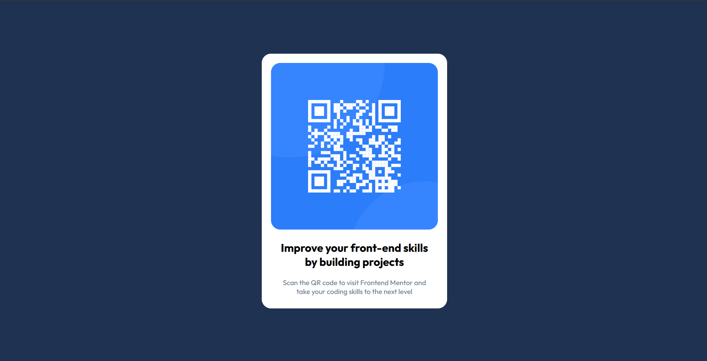

# Frontend Mentor - QR Code Component

This is my solution to the [QR Code Component challenge on Frontend Mentor](https://www.frontendmentor.io/challenges/qr-code-component-iux_sIO_H).  
Frontend Mentor challenges help you improve your coding skills by building realistic projects.  

---

## 🚀 Overview

### Screenshot
 

### Links
- Solution URL: [GitHub Repo](https://github.com/MohammedGousemohiyuddinYekkaluru/qr-code-component.git) 
- Live Site URL: [Live Demo]( https://mohammedgousemohiyuddinyekkaluru.github.io/qr-code-component/) 

---

## 💻 My Process

### Built With
- Semantic **HTML5**
- **CSS3** (Flexbox, responsive units)
- Google Fonts (**Outfit**)
- Mobile-first workflow

### What I Learned
While working on this challenge, I practiced:
- Centering elements using **flexbox**
- Using `max-width` and `rem/%` for responsiveness
- Styling images with `border-radius`
- Structuring a simple card component

```css
.container {
   display: flex;
   justify-content: center;
   align-items: center;
   height: 100vh;
}

## 📈 Continued Development

### I want to improve further by:

- Practicing more Frontend Mentor challenges

- Refining my responsive design skills

- Getting more comfortable with CSS variables and utility classes.

classes

## 🙌 Acknowledgments

- Challenge by Frontend Mentor
.
- Coded by Mohammed Gouse.